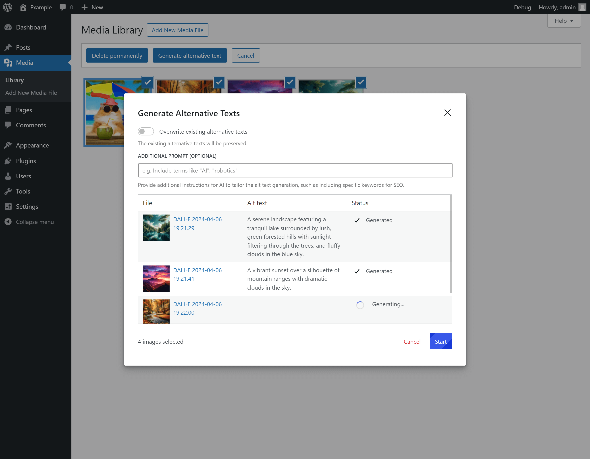

# GPT-Powered Alt Text Generator for WordPress

WordPress plugin that uses the GPT-4 API to automatically generate descriptive and contextually relevant alt text (matching your WordPress site's language) for
images during the upload process. This plugin is designed to enhance website accessibility and improve SEO with minimal
effort.

## Installation

You can download it here: https://wordpress.org/plugins/alt-text-generator-gpt-vision/

Or use composer:
```shell
composer require wpackagist-plugin/alt-text-generator-gpt-vision
```

> [!IMPORTANT]  
> The settings for the plugin are located in `Settings -> Media`.
> You need to enter your [OpenAI's API key](https://platform.openai.com/api-keys) there.

## Screenshots




## For Developers

### Filters

#### `acpl/ai_alt_generator/system_prompt`

Modifies the system prompt.

**Parameters:**
- `string $system_prompt`
- `int $attachment_id`
- `string $locale` - The current WordPress locale.
- `string $language` - The display name of the current WordPress language.

**Usage:**
```php
add_filter('acpl/ai_alt_generator/system_prompt', function($system_prompt, $attachment_id, $locale, $language) {
    // Modify the system prompt here
    return $system_prompt;
}, 10, 4);
```

#### `acpl/ai_alt_generator/user_prompt`

Modifies the user prompt.

**Parameters:**
- `string $user_prompt`
- `int $attachment_id`
- `string $locale` - The current WordPress locale.
- `string $language` - The display name of the current WordPress language.

**Usage:**
```php
add_filter('acpl/ai_alt_generator/user_prompt', function($user_prompt, $attachment_id, $locale, $language) {
    // Modify the user prompt here
    return $user_prompt;
}, 10, 4);
```

#### `acpl/ai_alt_generator/api_url`

Modifies the API URL used for generating alt text.

**Parameters:**
- `string $api_url` - Default: https://api.openai.com/v1/chat/completions

**Usage:**
```php
add_filter('acpl/ai_alt_generator/api_url', function($api_url) {
    // Modify the API URL here
    return $api_url;
});
```

#### `acpl/ai_alt_generator/api_request_headers`

Modifies the request headers sent to the OpenAI API.

**Parameters:**
- `array $request_headers`
- `string $api_key`
- `int $attachment_id`

#### `acpl/ai_alt_generator/api_request_body`

Modifies the request body sent to the OpenAI API.

**Parameters:**
- `array $request_body`
- `int $attachment_id`

## Contributing

If you would like to contribute to the development of this plugin, please follow these steps:

1. Fork the Repository: Start by forking the GitHub repository to your own account.
2. Clone Your Fork: Clone your forked repository to your local machine.
3. Install Dependencies:
   - Run `pnpm install` to install JavaScript dependencies. 
   - Run `composer install` to set up PHP dependencies.
4. Set Up Local Environment: Use `wp-env start` ([learn more](https://developer.wordpress.org/block-editor/reference-guides/packages/packages-env/)) to start a local WordPress environment for testing and development.
5. For JavaScript development, run `pnpm run dev`.
6. Make Your Changes: Implement your features or bug fixes in your fork.
7. Test Your Changes: Ensure that your changes don't break any existing functionality.
8. Create a Pull Request: Once you're happy with your changes, push them to your fork and create a pull request against the original repository.
