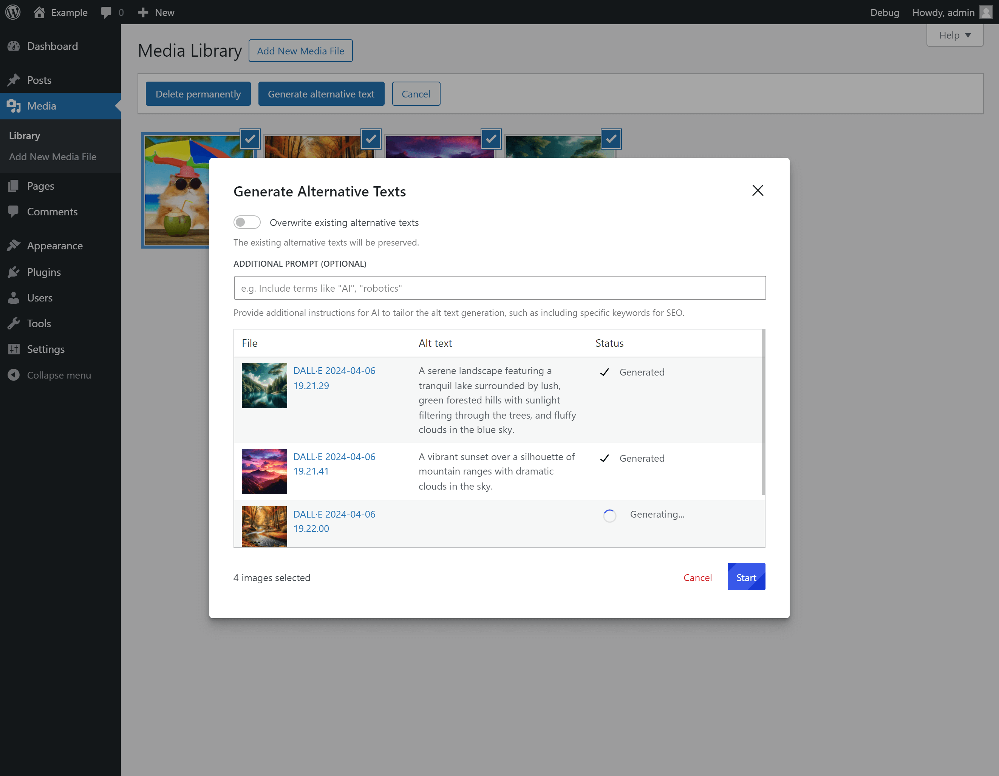

# AI Alt Text Generator for WordPress

Generate image alt text in your site's language on demand or in bulk. Helps improve accessibility and SEO. Automatic generation on upload is optional.

Uses the WordPress AI Client with your choice of AI provider, including OpenAI, Google Gemini, and Anthropic Claude.

## Installation

Requires **WordPress 7.0+** and **PHP 8.1+**.

Install and activate [AI Alt Text Generator from WordPress.org](https://wordpress.org/plugins/alt-text-generator-gpt-vision/) via **Plugins → Add New**, or download the ZIP and upload it there.

For [Roots Bedrock](https://roots.io/bedrock/) or another WordPress installation managed with Composer, run this from your site's project root:

```shell
composer require wp-plugin/alt-text-generator-gpt-vision
```

Your project must have the [WP Packages](https://wp-packages.org/) Composer repository and WordPress plugin installer configured (included in current Bedrock installations).

> [!IMPORTANT]
> Configure an AI provider with an image-capable model under **Settings → Connectors**.
> Then go to **Settings → Media** to choose a model, add custom instructions, or enable automatic generation on upload.

## Screenshots




## For Developers

### Programmatic usage via Abilities API

**Ability:** `acpl/generate-alt-text`

```php
$ability = wp_get_ability('acpl/generate-alt-text');
if (!$ability) {
    return;
}

$result = $ability->execute([
    'attachment_id' => 456, // Required. Image attachment ID.
    'user_prompt' => 'Write the alt text in Polish.', // Optional. Extra AI instructions.
    'save' => false, // Optional. False returns only; true saves to attachment metadata. Default false.
]);

if (is_wp_error($result)) {
    // Handle error.
    return;
}

$attachment_id = $result['attachment_id']; // 456
$alt_text = $result['alt']; // Generated alt text.
```

### Filters

#### `acpl/ai_alt_generator/system_prompt`

Modifies the system prompt.

**Parameters:**

- `string $system_prompt`
- `int $attachment_id`
- `string $locale` - The current WordPress locale.
- `string $language` - The display name of the current WordPress language.

**Usage:**

```php
add_filter('acpl/ai_alt_generator/system_prompt', function($system_prompt, $attachment_id, $locale, $language) {
    // Modify the system prompt here
    return $system_prompt;
}, 10, 4);
```

#### `acpl/ai_alt_generator/user_prompt`

Modifies the user prompt.

**Parameters:**

- `string $user_prompt`
- `int $attachment_id`
- `string $locale` - The current WordPress locale.
- `string $language` - The display name of the current WordPress language.

**Usage:**

```php
add_filter('acpl/ai_alt_generator/user_prompt', function($user_prompt, $attachment_id, $locale, $language) {
    // Modify the user prompt here
    return $user_prompt;
}, 10, 4);
```

#### `acpl/ai_alt_generator/attachment_locale`

Sets the locale code (e.g., `pl_PL`, `en_US`) used to determine the language for the generated alt text.

**Parameters:**

- `string $locale` - Default locale.
- `int $attachment_id` - Image attachment ID.
- `?int $context_post_id` - Parent post-ID being edited (if triggered inside the editor).

**Example:**

```php
add_filter('acpl/ai_alt_generator/attachment_locale', function (string $locale, int $attachment_id, ?int $context_post_id): string {
    return 'en_US';
}, 10, 3);
```

#### `acpl/ai_alt_generator/preferred_vision_models`

Overrides the list of preferred AI models used for alt text generation. Models are tried in order — the first one available on the site will be used. This is a preference, not a requirement; if none of the listed models are available, the plugin falls back to any compatible vision model.

**Parameters:**

- `array $models` - Ordered list of model IDs.

**Usage:**

```php
add_filter('acpl/ai_alt_generator/preferred_vision_models', function($models) {
    return ['gpt-5.6-luna', 'gemini-3.5-flash-lite'];
});
```

## Integrations

**Polylang:** automatically detects the language of the image or the post being edited.

## Contributing

1. Fork and clone the repository.
2. Install dependencies with `pnpm install` and `composer install`, then build assets with `pnpm run build`.
3. Start a local WordPress environment with [wp-env](https://developer.wordpress.org/block-editor/reference-guides/packages/packages-env/) and configure an AI provider under **Settings → Connectors**.
4. Use `pnpm run dev` for JavaScript development.
5. Test your changes and run the relevant checks: `pnpm run lint`, `pnpm run typecheck`, `pnpm run format:check`, `composer lint`, `composer analyse`, and `composer format:check`.
6. Open a pull request.
